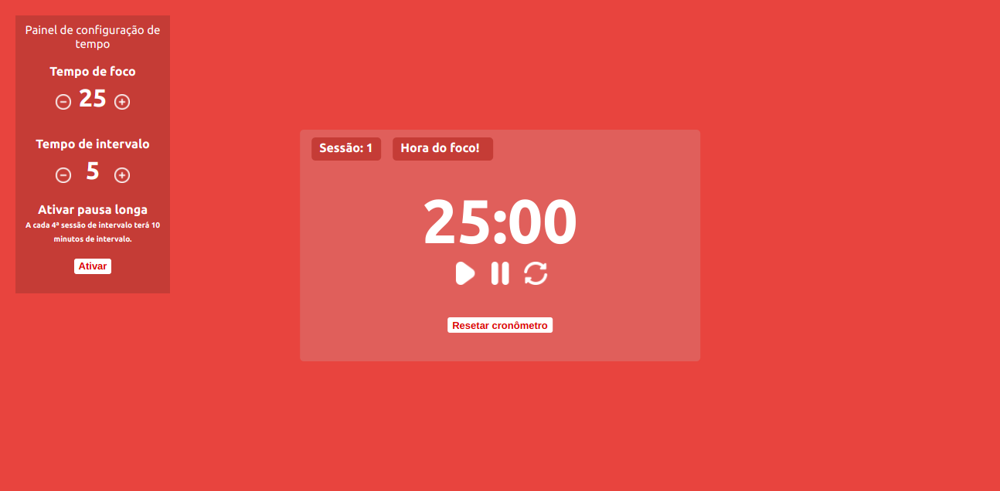
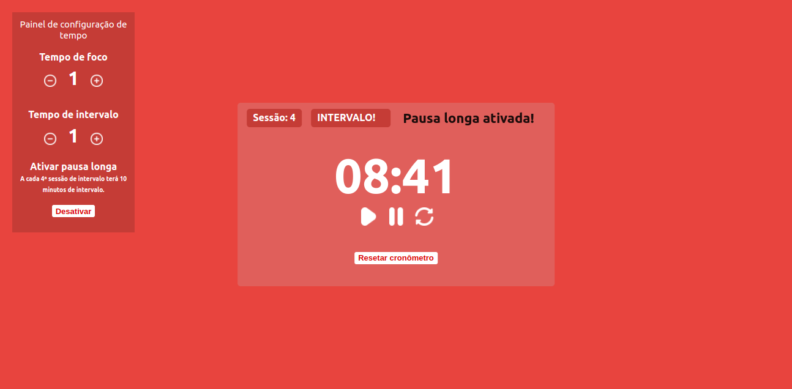

# Relógio Pomodoro

 
A Técnica Pomodoro é um método de gerenciamento de tempo desenvolvido por Francesco Cirillo no final dos anos 80. A técnica usa um cronômetro para dividir o trabalho em intervalos, tradicionalmente de 25 minutos de duração, separados por pequenos intervalos - 5 minutos.

## Histórias de usuário
* O usuário pode ver um temporizador por 25 minutos - **tempo dedicado a foco**.
* Após o término da sessão de trabalho , o usuário pode ver um cronômetro de 5 minutos - **tempo dedicado a intervalo**.
* O usuário pode *iniciar*/*pausar*, *parar* e *redefinir* os temporizadores.
* O usuário pode ouvir um som tocando quando o cronômetro toca `00:00` - denotando que a sessão terminou.
* O usuário pode alterar/personalizar os minutos em ambas as sessões antes de iniciar.
* O usuário pode definir uma sessão de pausa longa de 10 minutos. Isso será ativado a cada 4ª sessão de intervalo.

## Projetos usados como referência
* [Pomodoro do FreeCodeCamp](https://codepen.io/freeCodeCamp/full/XpKrrW)
* [Pomodoro do PomoFocus](https://pomofocus.io/)

